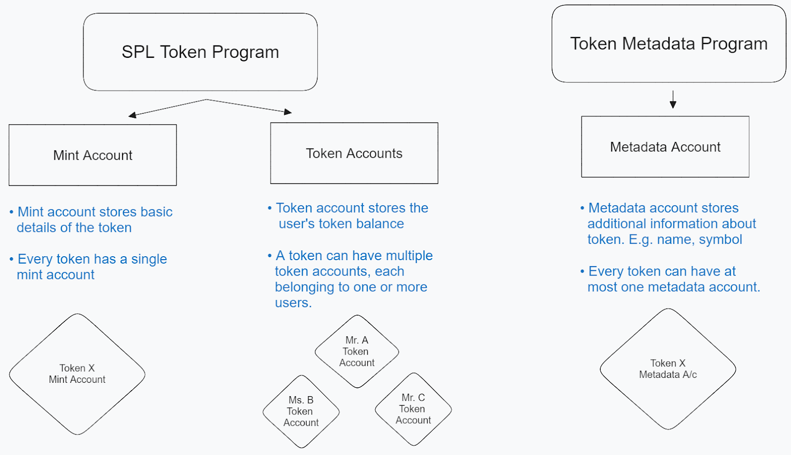

# Create your own token

## how tokens work on Solana
Solana has a unique architecture where the logic and state are stored in separate accounts. Since the logic is the same for every token, a single Program Account can be used for all the tokens on Solana, unlike Ethereum where every token has to create and deploy a new copy of ERC-20 contract. 

Therefore, the current token standard on Solana is to use the same Program known as SPL Token Program to create tokens and a different program from Metaplex known as Token Metadata Program to create data accounts for the token to store the token details and metadata respectively. The token Account stores data such as the balance and each one is owned and managed by the SPL Token Program.

Every token holder will need a token account. If we say that the Token X has 100 holders, it means that there are 100 different token accounts with active balance. Similarly, if we say that Mr. A holds 50 different tokens then he needs to have the 50 different token accounts with active balance

The final account is associated token account. It is a token account that is mapped to the user’s address. It is managed by the Associated Token Program and one major advantage is that it is automatically created when a token is transferred to a user that does not have a token account for the token. 

### create token

    spl-token create-token   //use this command to create token

It created a mint account for us with the following address, also by default it gave decimals 9. This is how many decimals your token can be broken into. Different tokens have different decimals depending upon the use case. You can set a custom one as well by adding a simple flag.

    spl-token create-token --decimals 12  // for 12 decimal points

### create token account
So now that we have created a mint account, we would also need to create a token account for handling the balances for this token, right? So, let’s do it!  {here - 3VRwbeJArj2AQgSXVUDPCLyD1q4JRwyo4FQja9BUJJvS}

    spl-token create-account <token-address>

### mint tokens
    spl-token mint <token-address> <amount-to-mint>

if we want to mint the new tokens to someone else’s account, we can provide the token account of the user in the above command as following:
    spl-token mint <token-address> <amount-to-mint> <user-token-account>

to check total supply
    spl-token supply <token-address>

You can view all the spl-token accounts under your wallet using the command
    spl-token accounts

Lets send this token 

    spl-token transfer <token-address> <amount> <recipient-address> --allow-unfunded-recipient --fund-recipient

See that we have added the flag –allow-unfunded-recipient to complete the transfer, and we are also adding the flag –fund-recipient because this is a new token and your friend won’t have an associated token account for your token account. The command will first create an associated token account for the recipient and then transfer the amount from the sender’s token account to the recipient’s associated token account.

### Associated Token Account (ATA)
when we are sending a token to someone, we can’t be sure that the person has a token account for that particular token or whether we’ll have to create one for them. 
Associated token program is the standard way to find out if token acc exists or not and such an account is known as an Associated Token Account or ATA.
ATA is in fact a program-derived-address (PDA) account.

The seeds of an ATA’s PDA comprise the user’s address, the mint account’s address and the Associated Token Program’s address. Since we have all three variables available to us, we can easily derive the ATA address for any user and check if such an ATA exists or not. 

